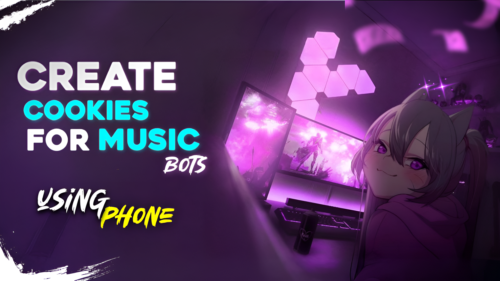

<h1 align="center">🎵 Alice Music Bot 🎵</h1>

  

<h2 align="center">Delivering a Superior Music Experience to Telegram</h2>

---

### 🌟 Features

- 🎵 **Multiple Cookies Support:** Use multiple cookies for playing music to avoid IP issues.
- 🎵 **Multiple Sources:** Play music from various platforms.
- 📃 **Queue System:** Organize your favorite songs in a playlist.
- 🔀 **Advanced Controls:** Options like shuffle, repeat, and more.
- 🎛 **Customizable Settings:** Adjust equalizer, normalization, and other audio preferences.
- 📢 **Crystal Clear Audio:** Enjoy high-quality playback.
- 🎚 **Volume Control:** Set the volume to your preferred level.

---

### 🖇 VPS [Deployment](https://thanos-organization.gitbook.io/alice-music)
Check out the [Documentation](https://thanos-organization.gitbook.io/alice-music/getting-started/quickstart) for detailed instructions on deploying Alice Music Bot on a VPS.

### 📺 How to make cookies in phone
just click on thumbnail to watch the tutorial

### 🛠 Commands & Usage

The Alice Music Bot offers various commands to enhance your music experience on Telegram:

| Command                 | Description                                 |
|-------------------------|---------------------------------------------|
| `/play <song name>`     | Play the requested song.                    |
| `/pause`                | Pause the current song.                     |
| `/resume`               | Resume the paused song.                     |
| `/skip`                 | Skip to the next song in the queue.         |
| `/stop`                 | Stop the bot and clear the queue.           |
| `/queue`                | Show the list of songs in the queue.        |

For a full list of commands, use `/help` in [Telegram](https://t.me/thanos_pro).

---

### 🔄 Updates & Support

Stay updated with the latest features and improvements for Alice Music Bot:

  
  

---

### 🤝 Contributing

We welcome contributions to the Alice Music Bot project. To contribute:

1. Fork the repository.
2. Create a new branch with a meaningful name.
3. Make your changes and commit them with a clear commit message.
4. Open a pull request against our `main` branch.
5. Our team will review your changes and provide feedback.

For more details, reach out to us on Telegram.

---

### 📜 License

This project is licensed under the MIT License. For more details, see the [LICENSE](LICENSE) file.

---

### 🙏 Acknowledgements

Special thanks to all contributors, supporters, and users of Alice Music Bot. Your feedback and support keep us going!
- [Yukki Music](https://github.com/TeamYukki/YukkiMusicBot)
- [AnonXMusic](https://github.com/AnonymousX1025/AnonXMusic) for their source code.
- 
